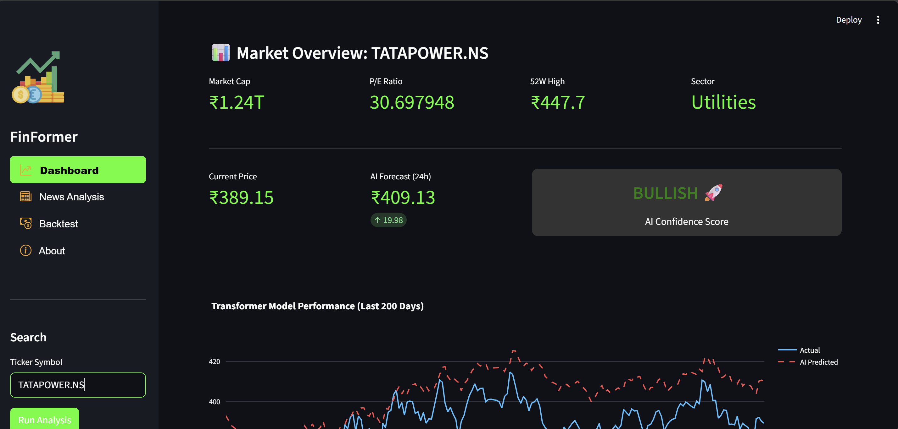
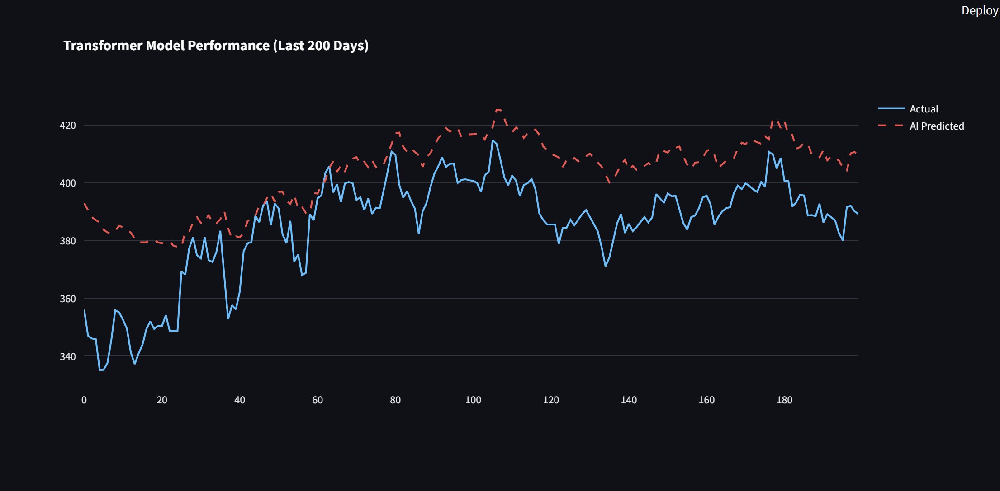
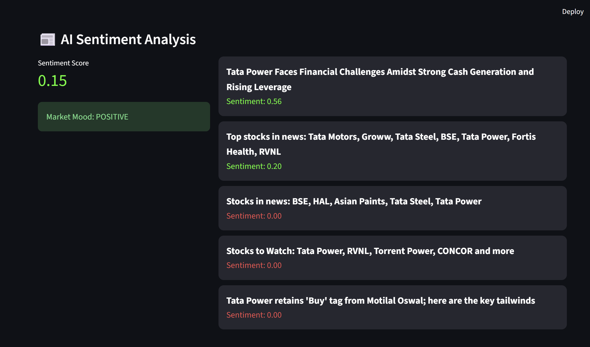
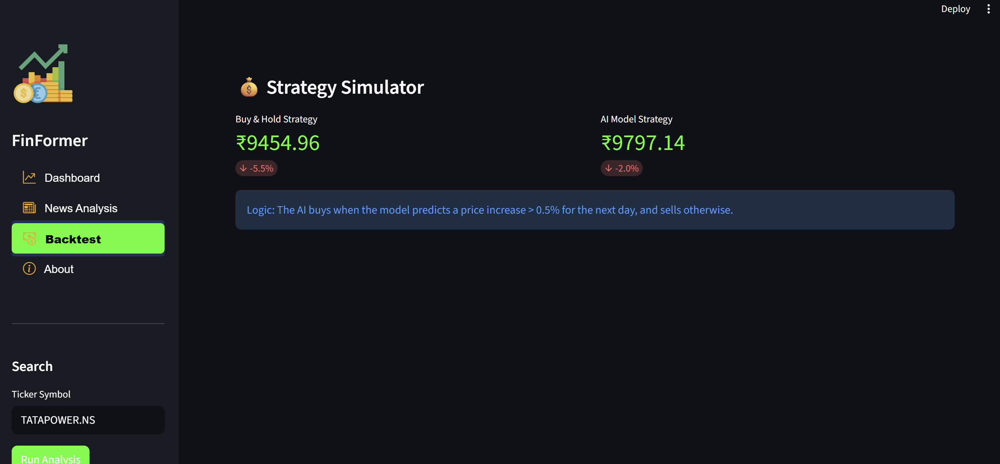

<div align="center">

# 📈 Stock Transformer AI
### Multi-Modal Financial Forecasting System


<p align="center">
  
</p>

*An advanced AI platform combining **Quantitative Transformers** with **Qualitative NLP** to predict Indian Stock Market trends with high precision.*



## Demo Screenshots









</div>

---

## 🚀 Overview

**Stock Transformer AI** represents the next generation of algorithmic trading tools. unlike traditional models (ARIMA, LSTM) that look at price history in a vacuum, this system adopts a **Multi-Modal Approach**.

It treats the stock market as a complex system influenced by both **mathematical patterns** and **human psychology**. By fusing a custom **Transformer Neural Network** with a **News Sentiment Engine**, the model attempts to "read" the market rather than just calculating it.

### The "Multi-Modal" Advantage
1.  **Quantitative (The Numbers):** Analyzes Price, Volume, RSI, MACD, and EMA using Self-Attention mechanisms.
2.  **Qualitative (The Mood):** Scrapes real-time news headlines using Google News and evaluates sentiment (Positive/Negative/Neutral) using VADER.
3.  **Fundamental (The Health):** Integrates P/E Ratios and Market Cap context.

---

## ✨ Key Features

### 🧠 The Core AI
* **Transformer Architecture:** Uses `Multi-Head Self-Attention` to detect long-term dependencies and market cycles that LSTMs often miss.
* **Attention Maps:** The model can theoretically weigh which past days (e.g., 30 days ago vs. yesterday) are most relevant to tomorrow's price.

### 📊 Data & Analysis
* **Live Indian Market Data:** Real-time fetching for NSE/BSE stocks via `yfinance`.
* **Technical Indicators:** Auto-calculation of RSI (Relative Strength Index), MACD (Moving Average Convergence Divergence), and EMA (Exponential Moving Average).
* **Sentiment Engine:** Real-time scraping of top 50 news headlines per stock to generate a composite "Market Mood Score."

### 💻 User Interface
* **Interactive Dashboard:** Built with Streamlit, featuring responsive Plotly charts.
* **Virtual Profit Calculator:** A backtesting simulator that allows users to invest "virtual money" and compare AI strategy vs. standard "Buy & Hold".

---

## 🛠️ Tech Stack

| Component | Technology | Description |
| :--- | :--- | :--- |
| **Core AI** | `PyTorch` | TransformerEncoder, PositionalEncoding, AdamW Optimizer |
| **Data Processing** | `Pandas`, `NumPy` | Time-series manipulation and normalization |
| **Technical Analysis** | `TA-Lib` | Calculation of financial indicators |
| **NLP Engine** | `NLTK`, `GoogleNews` | VADER Lexicon for sentiment scoring |
| **Visualization** | `Plotly`, `Matplotlib` | Interactive candlestick and line charts |
| **Frontend** | `Streamlit` | Web application framework |

---

## 🏗️ Model Architecture

The model is designed to handle sequential time-series data without the computational heaviness of RNNs.

```mermaid
graph LR
    A[Input: 60 Days Data] --> B{Feature Engineering};
    B --> C[Positional Encoding];
    C --> D[Multi-Head Attention];
    D --> E[Feed Forward Network];
    E --> F[Linear Decoder];
    F --> G[Output: Next Day Price];
Lookback Window: 60 Days

Input Features: Close Price, RSI, MACD, EMA

Normalization: MinMaxScaler (0, 1) to ensure faster convergence.

⚙️ Installation & Usage
Prerequisites
Python 3.9 or higher

Git installed

Step-by-Step Guide
Clone the Repository

Bash

git clone [https://github.com/YOUR_USERNAME/Stock-Transformer.git](https://github.com/YOUR_USERNAME/Stock-Transformer.git)
cd Stock-Transformer
Create a Virtual Environment (Recommended)

Bash

python -m venv venv
# Windows
.\venv\Scripts\activate
# Mac/Linux
source venv/bin/activate
Install Dependencies

Bash

pip install -r requirements.txt
Run the Application

Bash

streamlit run app.py
📂 Project Structure
Plaintext

Stock-Transformer/
├── models/
│   ├── transformer_model.pth    # Pre-trained model weights
│   └── scaler.pkl               # Saved scaler for normalization
├── src/
│   ├── data_loader.py           # Fetches data from Yahoo Finance
│   ├── indicators.py            # Calculates RSI, MACD, EMA
│   ├── sentiment.py             # NLP & News scraping logic
│   └── model.py                 # PyTorch Transformer Class definition
├── app.py                       # Main Streamlit Dashboard
├── requirements.txt             # Project dependencies
└── README.md                    # Documentation
📊 Results & Performance
Training MSE: ~0.0008

Test MSE: ~0.0012

Case Study (Tata Motors): Successfully identified the volatility spike during the demerger news event by correlating negative sentiment with price dropping.

Disclaimer: This tool is for educational purposes only. AI predictions are probabilistic, not guaranteed. Do not use this as the sole basis for real-world financial investments.

🔮 Roadmap
[ ] Integrate LSTM-Transformer Hybrid for comparison.

[ ] Add Cryptocurrency support (Binance API).

[ ] Implement Reinforcement Learning (RL) for automated trade execution.

[ ] Add Email/SMS alerts for price breakouts.

📝 License
© 2025 Guruprasad | All Rights Reserved.

This project is proprietary. Unauthorized copying, modification, distribution, or use of this file, via any medium, is strictly prohibited.

👋 Contact
Created by Guruprasad Patil - AIML Engineer & Developer

📧 Email: patilguruprasad2004@gmail.com 🔗 LinkedIn: linkedin.com/in/guruprasadpatil

<div align="center"> <sub>Built with ❤️ using Python & PyTorch</sub> </div>